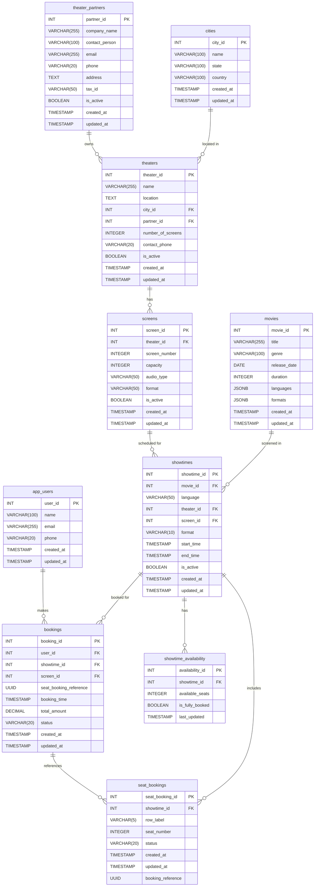

# Database Design Documentation

## Overview
This document outlines the database schema for the Booking Platform, including entity relationships, table structures, and data types.

## Entity Relationship Diagram



## Table Descriptions

### User Management

#### app_users

Stores user account information for the booking platform.

| Column      | Type         | Nullable | Default | Description |
|-------------|--------------|----------|---------|-------------|
| user_id     | SERIAL       | NO       |         | Primary key |
| name        | VARCHAR(100) | NO       |         | User's full name |
| email       | VARCHAR(255) | NO       |         | Unique email address, used for login |
| phone       | VARCHAR(20)  | YES      | NULL    | Contact number |
| created_at  | TIMESTAMP    | NO       | CURRENT_TIMESTAMP | Record creation time |
| updated_at  | TIMESTAMP    | NO       | CURRENT_TIMESTAMP | Last update time |

**Indexes:**
- `idx_user_email` (email) - For fast lookups by email

**Comments:**
- Email is case-insensitive and must be unique
- Phone number follows E.164 format but is optional

---

### Partner Management

#### theater_partners

Stores information about business partners who own theaters.

| Column          | Type         | Nullable | Default | Description |
|-----------------|--------------|----------|---------|-------------|
| partner_id      | SERIAL       | NO       |         | Primary key |
| company_name    | VARCHAR(255) | NO       |         | Legal business name |
| contact_person  | VARCHAR(100) | NO       |         | Primary contact name |
| email           | VARCHAR(255) | NO       |         | Business email (unique) |
| phone           | VARCHAR(20)  | NO       |         | Contact number |
| address         | TEXT         | YES      | NULL    | Full business address |
| tax_id          | VARCHAR(50)  | NO       |         | Business tax identification number |
| is_active       | BOOLEAN      | NO       | TRUE    | Partner account status |
| created_at      | TIMESTAMP    | NO       | CURRENT_TIMESTAMP | Record creation time |
| updated_at      | TIMESTAMP    | NO       | CURRENT_TIMESTAMP | Last update time |

**Indexes:**
- `idx_partner_email` (email) - For authentication lookups
- `idx_partner_tax_id` (tax_id) - For financial reporting

**Comments:**
- Tax ID format is validated per country
- Inactive partners cannot add new showtimes

---

### Location Management

#### cities

Stores city information where theaters are located.

| Column      | Type         | Nullable | Default | Description |
|-------------|--------------|----------|---------|-------------|
| city_id     | SERIAL       | NO       |         | Primary key |
| name        | VARCHAR(100) | NO       |         | City name |
| state       | VARCHAR(100) | NO       |         | State/Province |
| country     | VARCHAR(100) | NO       |         | Country |
| created_at  | TIMESTAMP    | NO       | CURRENT_TIMESTAMP | Record creation time |
| updated_at  | TIMESTAMP    | NO       | CURRENT_TIMESTAMP | Last update time |

**Indexes:**
- `idx_city_name` (name) - For searching cities by name

**Comments:**
- Used for location-based filtering of theaters
- City names are stored in title case

---

### Theater Management

#### theaters

Stores information about movie theaters and their locations.

| Column              | Type         | Nullable | Default | Description |
|---------------------|--------------|----------|---------|-------------|
| theater_id          | SERIAL       | NO       |         | Primary key |
| name                | VARCHAR(255) | NO       |         | Theater name |
| location            | TEXT         | NO       |         | Physical address |
| city_id             | INTEGER      | NO       |         | Reference to cities table |
| partner_id          | INTEGER      | YES      | NULL    | Reference to theater_partners (NULL for company-owned) |
| number_of_screens   | INTEGER      | NO       |         | Total screens in theater |
| contact_phone       | VARCHAR(20)  | NO       |         | Box office contact |
| is_active           | BOOLEAN      | NO       | TRUE    | Theater status |
| created_at          | TIMESTAMP    | NO       | CURRENT_TIMESTAMP | Record creation time |
| updated_at          | TIMESTAMP    | NO       | CURRENT_TIMESTAMP | Last update time |

**Foreign Keys:**
- `fk_theater_city` (city_id) REFERENCES cities(city_id)
- `fk_theater_partner` (partner_id) REFERENCES theater_partners(partner_id)

**Indexes:**
- `idx_theater_city` (city_id) - For location-based queries
- `idx_theater_partner` (partner_id) - For partner management

**Comments:**
- Inactive theaters won't appear in search results
- Contact phone is used for customer inquiries

#### screens

Represents individual screens within a theater where movies are shown.

| Column        | Type         | Nullable | Default | Description |
|---------------|--------------|----------|---------|-------------|
| screen_id     | SERIAL       | NO       |         | Primary key |
| theater_id    | INTEGER      | NO       |         | Reference to theaters table |
| screen_number | INTEGER      | NO       |         | Screen number within theater |
| capacity     | INTEGER      | NO       |         | Maximum number of seats |
| audio_type   | VARCHAR(50)  | NO       |         | Audio format (e.g., Dolby, DTS) |
| format       | VARCHAR(50)  | NO       |         | Screen format (2D, 3D, IMAX) |
| is_active    | BOOLEAN     | NO       | TRUE    | Screen status |
| created_at   | TIMESTAMP   | NO       | CURRENT_TIMESTAMP | Record creation time |
| updated_at   | TIMESTAMP   | NO       | CURRENT_TIMESTAMP | Last update time |

**Foreign Keys:**
- `fk_screen_theater` (theater_id) REFERENCES theaters(theater_id) ON DELETE CASCADE

**Constraints:**
- `uq_theater_screen` UNIQUE (theater_id, screen_number) - Ensures no duplicate screen numbers per theater

**Indexes:**
- `idx_screen_theater` (theater_id) - For theater-based queries

**Comments:**
- Screen numbers are unique within a theater
- Capacity is used to validate seat availability
- Audio and format affect ticket pricing

### Movie Management

#### movies

Stores information about movies available for booking.

| Column        | Type         | Nullable | Default | Description |
|---------------|--------------|----------|---------|-------------|
| movie_id      | SERIAL       | NO       |         | Primary key |
| title         | VARCHAR(255) | NO       |         | Movie title |
| genre         | VARCHAR(100) | NO       |         | Primary genre |
| release_date  | DATE         | NO       |         | Theatrical release date |
| duration      | INTEGER      | NO       |         | Runtime in minutes |
| languages     | JSONB        | NO       |         | Array of available languages |
| formats       | JSONB        | NO       |         | Array of available formats |
| created_at    | TIMESTAMP    | NO       | CURRENT_TIMESTAMP | Record creation time |
| updated_at    | TIMESTAMP    | NO       | CURRENT_TIMESTAMP | Last update time |

**Indexes:**
- `idx_movie_title` (title) - For searching by title
- `idx_movie_release_date` (release_date) - For filtering by release date

**Comments:**
- Languages stored as JSON array (e.g., ["English", "Hindi"])
- Formats stored as JSON array (e.g., ["2D", "3D", "IMAX"])
- Duration includes all trailers and advertisements

---

### Showtime Management

#### showtimes

Stores scheduled movie screenings at specific screens.

| Column        | Type         | Nullable | Default | Description |
|---------------|--------------|----------|---------|-------------|
| showtime_id   | SERIAL       | NO       |         | Primary key |
| movie_id      | INTEGER      | NO       |         | Reference to movies |
| language      | VARCHAR(50)  | NO       |         | Show language |
| theater_id    | INTEGER      | NO       |         | Reference to theaters |
| screen_id     | INTEGER      | NO       |         | Reference to screens |
| format        | VARCHAR(10)  | NO       | '2D'    | Show format |
| start_time    | TIMESTAMP    | NO       |         | Show start time |
| end_time      | TIMESTAMP    | NO       |         | Show end time |
| is_active     | BOOLEAN     | NO       | TRUE    | Show status |
| created_at    | TIMESTAMP   | NO       | CURRENT_TIMESTAMP | Record creation time |
| updated_at    | TIMESTAMP   | NO       | CURRENT_TIMESTAMP | Last update time |

**Foreign Keys:**
- `fk_showtime_movie` (movie_id) REFERENCES movies(movie_id) ON DELETE CASCADE
- `fk_showtime_theater` (theater_id) REFERENCES theaters(theater_id) ON DELETE CASCADE
- `fk_showtime_screen` (screen_id) REFERENCES screens(screen_id) ON DELETE CASCADE

**Constraints:**
- `chk_showtime_duration` CHECK (end_time > start_time) - Ensures valid show duration

**Indexes:**
- `idx_showtime_movie` (movie_id) - For movie-based queries
- `idx_showtime_theater` (theater_id) - For theater-based queries
- `idx_showtime_screen` (screen_id) - For screen-based queries
- `idx_showtime_datetime` (start_time, end_time) - For time-based queries

**Comments:**
- End time is calculated based on movie duration + cleaning time
- Inactive showtimes won't appear in search results
- Format must be one of the formats listed in the movie's formats

#### showtime_availability

Tracks real-time seat availability for showtimes. This is a denormalized table that provides quick access to showtime availability without needing to count seats on every request.

| Column            | Type         | Nullable | Default | Description |
|-------------------|--------------|----------|---------|-------------|
| availability_id   | SERIAL       | NO       |         | Primary key |
| showtime_id       | INTEGER      | NO       |         | Reference to showtimes |
| available_seats   | INTEGER      | NO       |         | Number of available seats |
| is_fully_booked   | BOOLEAN      | NO       | FALSE   | Booking status |
| last_updated      | TIMESTAMP    | NO       | CURRENT_TIMESTAMP | Last update time |

**Foreign Keys:**
- `fk_availability_showtime` (showtime_id) REFERENCES showtimes(showtime_id) ON DELETE CASCADE

**Indexes:**
- `idx_availability_showtime` (showtime_id) - For showtime lookups
- `idx_availability_status` (is_fully_booked) - For filtering by booking status

**Synchronization Strategy:**

1. **Initial Population**: 
   - When a new showtime is created, initialize `available_seats` with the screen's capacity and `is_fully_booked` as FALSE.

2. **On New Booking**:
   ```sql
   -- Pseudo-code for transaction
   BEGIN;
   -- 1. Check if seats are available
   SELECT available_seats, is_fully_booked 
   FROM showtime_availability 
   WHERE showtime_id = ? AND is_fully_booked = FALSE
   FOR UPDATE;  -- Lock the row
   
   -- 2. If available, insert seat bookings
   INSERT INTO seat_bookings (...) VALUES (...);
   
   -- 3. Update availability
   UPDATE showtime_availability
   SET available_seats = available_seats - ?,
       is_fully_booked = (available_seats - ?) <= 0,
       last_updated = CURRENT_TIMESTAMP
   WHERE showtime_id = ?;
   COMMIT;
   ```

3. **On Booking Cancellation**:
   ```sql
   -- Pseudo-code for transaction
   BEGIN;
   -- 1. Delete the seat booking
   DELETE FROM seat_bookings WHERE booking_reference = ?;
   
   -- 2. Update availability
   UPDATE showtime_availability
   SET available_seats = LEAST(
       (SELECT capacity FROM screens WHERE screen_id = ?),
       available_seats + ?
     ),
     is_fully_booked = FALSE,
     last_updated = CURRENT_TIMESTAMP
   WHERE showtime_id = ?;
   COMMIT;
   ```

4. **Consistency Checks**:
   - Run periodic background jobs to verify and correct any discrepancies:
   ```sql
   -- Example verification query
   SELECT 
     sa.showtime_id,
     sa.available_seats as reported_available,
     (s.capacity - COUNT(sb.seat_booking_id)) as actual_available,
     sa.is_fully_booked as reported_status,
     (s.capacity - COUNT(sb.seat_booking_id)) <= 0 as actual_status
   FROM showtime_availability sa
   JOIN screens s ON s.screen_id = ?
   LEFT JOIN seat_bookings sb ON sb.showtime_id = sa.showtime_id
   WHERE sa.showtime_id = ?
   GROUP BY sa.showtime_id, sa.available_seats, sa.is_fully_booked, s.capacity;
   ```

**Concurrency Handling:**
- Use database-level row locking (`SELECT ... FOR UPDATE`) to prevent race conditions
- Implement retry logic for failed transactions due to deadlocks
- Consider using database triggers for critical updates if the application layer might miss updates

**Performance Considerations:**
- The `is_fully_booked` flag allows for quick filtering of sold-out shows
- The `last_updated` field helps with cache invalidation
- Consider adding a read replica for availability checks if under heavy load


#### Bookings

Tracks user ticket bookings.

| Column        | Type          | Description                                 |
| ------------- | ------------- | ------------------------------------------- |
| booking\_id   | INT           | Primary key, auto-increment                 |
| user\_id      | INT           | Reference to user                           |
| showtime\_id  | INT           | Reference to showtime                       |
| screen\_id    | INT           | Reference to screen                         |
| seats\_booked | INT           | Number of seats booked                      |
| total\_price  | DECIMAL(10,2) | Total booking amount                        |
| status        | VARCHAR(20)   | Booking status (CONFIRMED, CANCELLED, etc.) |
| booking\_time | TIMESTAMP     | When booking was made                       |
| created\_at   | TIMESTAMP     | Record creation timestamp                   |
| updated\_at   | TIMESTAMP     | Last update timestamp                       |

**Foreign Keys:**

* `fk_booking_user` (user\_id) REFERENCES AppUsers(user\_id)
* `fk_booking_showtime` (showtime\_id) REFERENCES Showtimes(showtime\_id)
* `fk_booking_screen` (screen\_id) REFERENCES Screens(screen\_id)

**Indexes:**

* `idx_booking_user` (user\_id) - For user's booking history
* `idx_booking_showtime` (showtime\_id) - For showtime-based lookups
* `idx_booking_status` (status) - For filtering by booking status

#### Seat_Bookings

Tracks which specific seats are booked in a showtime.

| Column            | Type          | Description                           |
| ----------------- | ------------- | ------------------------------------- |
| seat\_booking\_id | INT           | Primary key, auto-increment           |
| booking\_id       | INT           | Reference to booking                  |
| showtime\_id      | INT           | Reference to showtime                 |
| screen\_id        | INT           | Reference to screen                   |
| row\_label        | VARCHAR(5)    | Row identifier                        |
| seat\_number      | INT           | Seat number in row                    |
| price             | DECIMAL(10,2) | Price paid for this seat              |
| status            | VARCHAR(20)   | Seat status (BOOKED, CANCELLED, etc.) |
| created\_at       | TIMESTAMP     | Record creation timestamp             |
| updated\_at       | TIMESTAMP     | Last update timestamp                 |

**Foreign Keys:**

* `fk_seatbooking_booking` (booking\_id) REFERENCES Bookings(booking\_id)
* `fk_seatbooking_showtime` (showtime\_id) REFERENCES Showtimes(showtime\_id)
* `fk_seatbooking_screen` (screen\_id) REFERENCES Screens(screen\_id)

**Indexes:**

* `idx_seatbooking_showtime` (showtime\_id) - For showtime-based lookups
* `idx_seatbooking_booking` (booking\_id) - For booking-based lookups
* `idx_seatbooking_seat` (showtime\_id, screen\_id, row\_label, seat\_number) - For seat availability checks

## Performance Considerations

### Indexing Strategy
- **Primary Indexes**: All tables have a primary key index on their ID column
- **Foreign Key Indexes**: All foreign key columns are indexed for join performance
- **Search Indexes**: Frequently searched columns have appropriate indexes
- **Composite Indexes**: Added for common query patterns (e.g., date ranges, status lookups)

### Query Optimization
- **Read Performance**:
  - Read replicas for reporting queries
  - Caching layer for frequently accessed data (e.g., movie details, theater info)
  - Denormalized data where appropriate for read-heavy operations

- **Write Performance**:
  - Batch inserts for bulk operations (e.g., showtime creation, seat assignment)
  - Asynchronous processing for non-critical updates (e.g., analytics, notifications)
  - Connection pooling for high concurrency during peak booking times

### Partitioning
- **Range Partitioning**:
  - Bookings table: Partitioned by booking date
  - Showtimes table: Partitioned by show date
  - Enables efficient pruning of partitions for date-range queries
  - Simplifies data archival and purging

- **List Partitioning**:
  - Theaters table: Partitioned by city_id
  - Enables efficient queries for theater-specific operations

## Data Retention Policy

1. **Active Data**
   - Bookings: 1 years
   - Showtimes: 1 year
   - User data: Indefinite (with right to be forgotten)

2. **Archival**
   - Bookings older than 1 year moved to booking_archival
   - Showtimes older than 1 year moved to showtime_archival
   - Archived data retained for 7 years for compliance

3. **Purging**
   - Archived data older than 7 years is automatically purged
   - User data is anonymized rather than deleted when possible

