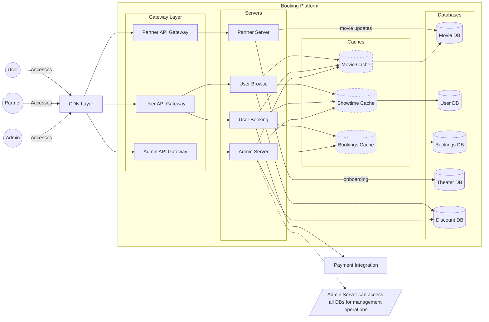
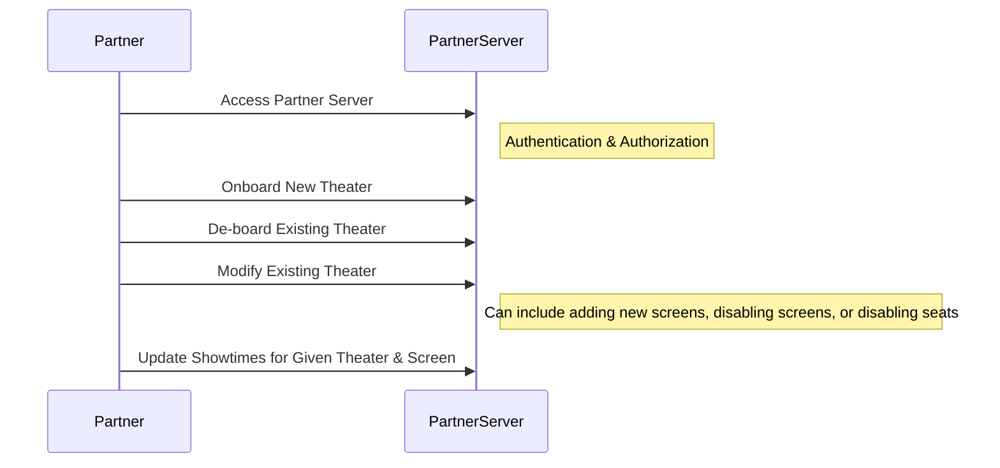
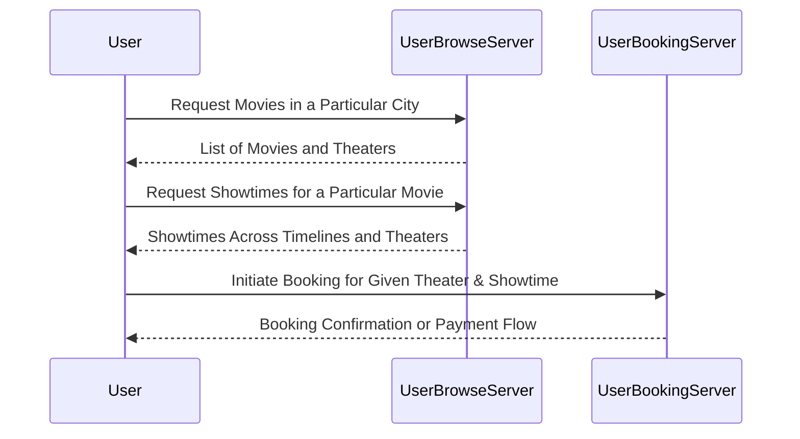

# High-Level Design (HLD) for Booking Platform

## Logical Architecture

## High-Level Components and Functions
1. CDN
   * WAF
   * IP Whitelisting
   * Rate Limiting ( High level mainly from security perspective)
   * Geo Routing
   * Caching Layer for static assets
2. Gateway
   * Authentication
   * Adding app specific headers ( Trace ID, Geo Flags, etc.)
   * Payload Compression
   * Rate Limiting at API level
3. App Servers
   * Authorization
   * Business Logic
4. Caches
   * Centralized 
5. Databases
   * SQL based ACID compliant

## Technical Stack & Processes
1. Development
   * Java 24
   * Reactive stack based on Spring Boot 4 with WebFlux and R2DBC
   * Maven
   * Docker
2. Deployment
   * SCM: Any Git based SCM (eg Bitbucket, GitHub, GitLab, etc)
   * CICD Orchestration: Jenkins pipelines,Bitbucket Pipelines, GitHub Actions etc
   * Infrastructure as code (IaC):
      - Terraform / openTofu
      - Region agnostic IaC implementation
3. Infrastructure ( AWS based, but can be migrated to GCP, Azure, etc.)
   * CDN: AWS CloudFront
   * Gateway: AWS API Gateway
   * Load Balancer: AWS ALB
   * Web Server: AWS ECS Services with rolling deployment
   * Caching: AWS ElasticCache-Redis
   * Database: AWS RDS:Postgres
5.Operations
   * APM: AWS CloudWatch / 3rd Party Tools (e.g. Datadog, New Relic, etc.)
   * Logging: Dynatrace / Splunk
   * Real User Monitoring: Catchpoint, New Relic, Datadog (  External Monitoring )

## Interactions
### Partner Interactions

#### Data Flow
1. **Theater & Other entity Management**
   - Authentication & Authorization
   - Direct writes to primary data stores
   - Cache invalidation for affected data, if any ( ex seats blocking due to spillage)

### User Interactions

#### Data Flow

1. **User Browsing Flow**
   - Browse Requests processed through dedicated browse service
   - Reads from cache to improve performance
   - View-Objects returned

2. **User Booking Flow**
   - Booking requests processed through dedicated booking service
   - Cache based blocking of seats till payment is completed
   - DB updated on successful payment

3. **Theater & Other entity Management**
   - Direct writes to primary data stores
   - Cache invalidation for affected data, if any

## Development Process
### Development
 * Code Development in local IDE
 * Unit & Integration Tests with code quality checks before or during PR
 * PR based Code Review
 * Merge to trigger CICD Pipeline, pushing artifact into artifact repository, with Semver versioning
 * On-demand deployments to environments ( Dev, QA, Staging, Production )
 * Artifact promotion on respective sign-off
   * Dev - Developers
   * QA - Quality Assurance Engineers
   * Staging - Staging Engineers & Product Owners
   * Production - Production Engineers  & Product Owners & Operations Engineers
 * Release
   * Rolling deployment of promoted artifacts
   * Release Notes & Changelog

### Quality Assurance
   * Unit & Integration Tests at component level
   * Code Coverage & Static Analysis gated builds, integrated
   * Regression Testing at API level
   * Performance/Load Testing at API level
   * Environments: Dev, QA, Staging, Production

### Change Management
- **Schema Changes**:
   * Version-controlled migration scripts
   * Backward compatibility maintained during deployments
   * Zero-downtime migrations where possible

### Documentation
  * Coding Standards
  * Review Guidelines
  * Process Documentation
  * Deployment & rollbacks
  * Release management
  * Links to dashboard for monitoring for respect apps/environments

## Operations
### Monitoring & Observability

1. **Metrics Collection**
   * Application performance metrics (APM) (e.g., request latency, memory usage, failures, cache hit rate)
   * Business/Reporting metrics (bookings, users, revenue, occupancy)
   * System health indicators (e.g., CPU usage, memory usage, disk usage)
2. **Logging**
   * Structured logging for all services, using trace & span IDs
   * Centralized log aggregation, with 90 days retention
   * Dashboards for monitoring & debugging
3. **Tracing**
   * Distributed request tracing (trace & span IDs)
     - Gateway to add trace headers & geo flags as well
   * End-to-end transaction tracking\
4. **Alerting**:
    * Standard alerts configured for critical issues
    * Custom alerts for specific use cases (  Eg Long-running query alerts )
5. Real User Monitoring:
   * Catchpoint, New Relic, Datadog (  External Monitoring )
   * Alert Setup for incidents and performance degradation
   
### Regular Maintenance
   * Weekly index rebuilds/defragmentation
   * Archival activity on daily basis for x days old data eg 7 days old data to be archived

### Incident Management
- Workflow with RACI advisory
- Standard templates for incident management, RCA & resolution
- Incident escalation path with rotation of assignees

### Backup Strategy
- **Full Backups**:
   * Nightly full database backups (main tables)
   * Archived tables backed up in long term storage ( e.g. AWS Glacier)
   * Transaction log backups every 15 minutes, retained for 90 days.

### Disaster Recovery
- **Recovery Point Objective (RPO)**: 5 minutes
- **Recovery Time Objective (RTO)**: 10 minutes
- **Regular DR drills**: Quarterly testing of backup restoration
- **DRP Review**: Twice a year

## Scalability & Performance Considerations

1. **Performance Optimizations**
   * Caching headers for client side caching (eg ETag, Last-Modified)
   * Edge-Caching for static assets e.g. movie posters, details, trailers, etc with longer ttl
   * Centralized caching for frequently accessed data
      - Use of TTL for automatic cache invalidation
      - Use of MFU (Most Frequently Used) strategy
      - Future Considerations
         - Pre-warm up the cache for high demand movies
   * Database
      - Query optimization and indexing
      - Time-range based partitioning (weekly)
      - Future Considerations
         - Sharding based on cities, theaters, etc
2. **High availability**
   * Rolling deployment strategy to minimize downtime
   * Horizontal Scaling using auto-scaling
      - Stateless architecture
      - Reactive implementation
   * Load balancers for traffic distribution
      - Functionality segmentation based on traffic patterns ( admin, partner, user )
      - Multiple app-server instances to distribute load within module/function****
      - Heath checks to avoid traffic routing to unhealthy instances
3. **Fault Tolerance**
   * Load balancers with minimum of 2 instances covering at-least2 Availability-Zones in a region
   * Fail-fast for booking operations
   * Use of read replicas for read-heavy operations, in cache clusters
   * Database replication

## Security Considerations

1. **Network Security**
   * CORS for cross-origin requests (client-side)
   * WAF (Web Application Firewall) for HTTP traffic
   * IP address whitelisting
   * SSL/TLS for secure communication ( no http endpoints )
   * Rate limiting for API endpoints
   * Captcha for suspicious calls

2. **Authentication & Authorization**
   * Role-based access control (RBAC)
   * JWT for stateless authentication
   * Principle of Least Privilege

3. **Data Protection**
   * Encryption in transit (TLS 1.2+)
   * Sensitive data encryption at rest
   * Encryption keys managed through a dedicated key management service (Eg AWS KMS)
   * Sensitive fields masked in logs and non-production environments
   * Regular security audits and penetration testing (eg Snyk, WHS, etc)

4. **Audit Logging**:
   * All DDL operations logged
   * Sensitive data access logged
   * Failed login attempts logged

5. **Compliance**:
   * Regular security assessments and penetration testing
   * SAST & DAST on regular cadence (eg every merge on scm, every monthly release)
   * SBOM (Software Bill of Materials) managed through a dedicated service
   * Documentation of roles, processes, and policies
   * Compliance with relevant regulations (e.g., GDPR, CCPA)
   * Data retention policies enforced through automated processes

## Technical Constraints

1. **Assumptions**
   - Users will book tickets within their geographic region
   - Theaters will manage their own show schedules
   - Theater partners will not be doing their separate bookings
   - Payment processing handled by external payment gateway

2. **Exclusions**
   - Search functionality ( eg search by movie name)
   - Authentication & Authorization
   - User interfaces (admin, theater partner & users)
   - Payment gateway integration details (payment & refunds)
   - Staff management systems (Admin)
   - User Account Management (crud + history)
   - Movie management
      - Full text search
      - Feedback & ratings
      - Recommendations based on user preferences
   - Theater Partner
      - Detailed layouts
      - Seat category & pricing management
      - Reporting